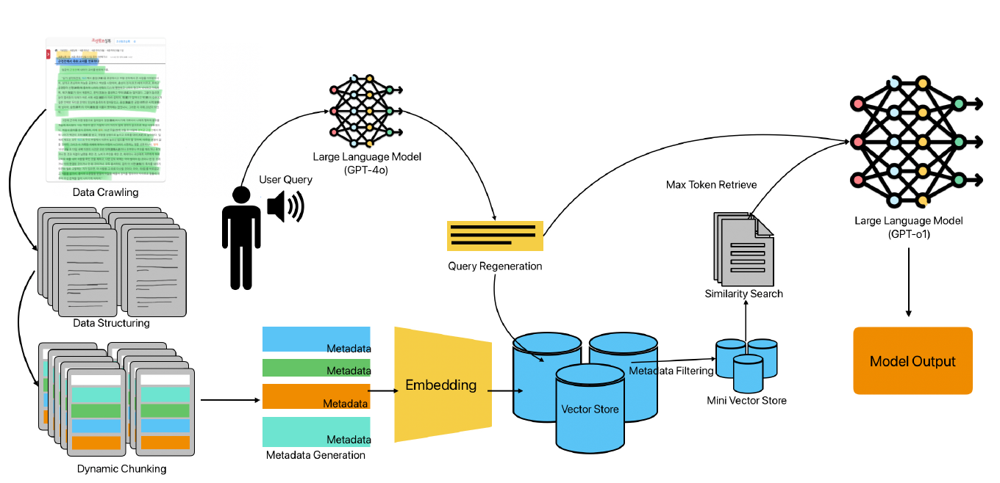
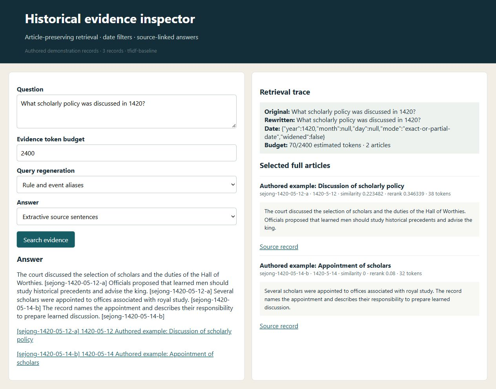

# A Retrieval‐Augmented Generation System for Accurate and Contextual Historical Analysis: AI‐Agent for the Annals of the Joseon Dynasty

**Jeong Ha Lee, Ghazanfar Ali, Jae‐In Hwang**

**Computer Animation and Virtual Worlds · 2025** · Published

[Paper / publisher](https://doi.org/10.1002/cav.70048) · [Project page](https://ghazanfarali.com/research/joseon-rag-journal/) · [BibTeX](citation.bib) · [Requirements](REQUIREMENTS.md) · [Code & setup](#implementation-and-usage)

> Article-aware retrieval grounds answers in the Annals of the Joseon Dynasty.



*Original method figure from the paper: Figure 1, PDF page 2. Extracted for this research introduction; the diagram describes the original system, not verification of this reimplementation.*

## Why this research

Dense historical records are difficult to search and interpret reliably. Preserving article boundaries and temporal context helps a language model answer with traceable historical evidence.

The agent preserves historical article boundaries, uses date metadata and query refinement to retrieve evidence, and supplies that evidence to a language model. Its purpose is to support factual answers and contextual interpretation with traceable sources.

## Method at a glance

**Historical question** → **Date-aware evidence retrieval** → **Answer + source citations**

| | Research system |
|---|---|
| Input | A historical question and the Annals corpus |
| Method | Article-aware chunking, date-aware retrieval, query refinement, and LLM response generation |
| Output | Source-grounded answers and contextual analysis |

## Evidence and scope

Paper reports improvements of approximately 23–50 points on its 100-point evaluation scale over the compared systems

**Attribution:** These findings describe the paper or manuscript, not results obtained with this repository's code.

**Study context:** Annals of the Joseon Dynasty.

**Limitations:** Evidence comes from the paper’s historical task and benchmark; it does not guarantee factual correctness for arbitrary questions.

## Explore the implementation

Article-preserving ingestion with a resumable Sejong Annals crawler, date parsing and filtering, query regeneration, Korean-aware retrieval, evidence traces, and extractive or optional grounded LLM answers with contextual analysis and explicit abstention.

This repository contains independently written research code. The institute's original source, datasets and trained models are not distributed. Public-data preparation, commands, assumptions and checks are documented below and in [REQUIREMENTS.md](REQUIREMENTS.md).

## Resources and citation

Read the paper through its [publisher record](https://doi.org/10.1002/cav.70048). PDFs are hosted by publishers or preprint archives rather than stored in this repository.

Please cite the research paper when using its ideas; [download the BibTeX citation](citation.bib). The implementation has its own documented scope.

**Licence.** The code is released under the [MIT licence](LICENSE). It covers the code only: crawled Annals text stays on your machine and follows the source site's terms.

<!-- demo-preview:start -->
## Demo preview



*Local demo with small starter examples; the capture illustrates the interface, not a reproduced paper benchmark.*

From the repository root, using the Python environment described below:

```sh
python -m pip install -e .
python scripts/start_demo.py
```

Open **http://127.0.0.1:8080/**. Click **Search evidence** on the prefilled question to inspect the bundled authored articles, retrieval trace and citations. The launcher selects the bundled inputs automatically; it also builds the small authored retrieval index. Model weights and public datasets are optional for the starter workflow and are prepared separately for real-data use.

<!-- demo-preview:end -->

## Implementation and usage

<!-- implementation-guide -->

This repository implements an evidence-first pipeline for dense chronological records: one complete source article per chunk, date metadata, auditable query regeneration, exact/partial/range date filters with safe widening for inferred dates, Korean-aware TF-IDF retrieval, a transparent reranker, maximum-token retrieval, a similarity floor with explicit abstention, extractive or model-generated answers, and source citations. A rate-limited, resumable crawler builds a Sejong Annals corpus locally.

**Citation.** Jeong Ha Lee, Ghazanfar Ali, and Jae-In Hwang. “A Retrieval-Augmented Generation System for Accurate and Contextual Historical Analysis: AI-Agent for the Annals of the Joseon Dynasty.” *Computer Animation and Virtual Worlds* (2025), e70048. [https://doi.org/10.1002/cav.70048](https://doi.org/10.1002/cav.70048). Status: published.

This is an independent educational implementation. It is not the institute implementation and does not ship the Annals corpus, crawler output, API credentials, embedding cache, model weights, benchmark, or the paper's original prompts. The prompts in `src/joseon_rag/core.py` (`PROMPT_PROFILES`) were written from the paper's description.

### Start the evidence inspector

```powershell
python -m venv .venv
.venv\Scripts\Activate.ps1
python -m pip install -e .
joseon-rag build examples/articles.jsonl --out outputs/demo.index.json
joseon-rag serve outputs/demo.index.json --events examples/events.json
```

Open `http://127.0.0.1:8765`. The bundled articles are authored interface examples, not Annals records. The browser shows rewritten queries, date filters, whole-article evidence, token use and citations. For an offline JSON check, run `python scripts/verify.py`; its answer includes the full retrieval trace.

### Build the Sejong Annals corpus

The paper crawled the Sejong Annals from the official National Institute of Korean History service, [Annals of the Joseon Dynasty](https://sillok.history.go.kr/). `joseon-rag crawl` does the same locally. It reads the Sejong month index, then each lunar month's article list, then each article page. It writes one JSONL record per article:

```powershell
joseon-rag crawl --out data/sejong.jsonl --cache data/sillok-cache --years 2 --max-articles 20
joseon-rag crawl --out data/sejong.jsonl --cache data/sillok-cache            # full reign; rerun to resume
joseon-rag build data/sejong.jsonl --out outputs/sejong.index.json
```

- **Politeness.** Requests are at least 1 s apart (default 1.5 s) and use an identifying user agent. The crawler re-reads `robots.txt` on every run. It stops on HTTP 401/403 or on persistent 429/5xx responses.
- **Resuming.** Every page is cached under `--cache`. Rerunning the same command skips article IDs already in the output file and refetches nothing that is cached. `--offline` parses the cache only.
- **Scale.** The month index lists 391 lunar months (reign years 0–32, including 12 leap months); the paper reports 30,949 articles. A full crawl therefore takes at least 13 hours at the default delay.
- **Records.** Each record holds the article ID (for example `kda_10205029_001`), title, Korean translation as `text`, source URL, volume, footnotes, categories, and the page's date line as `date_original`. `--include-hanja` adds the classical-Chinese original as `hanja_text`.
- **Dates.** Dates stay in the Annals' lunar calendar. `year` is the Western year printed with the record (세종 N년 = 1418 + N; the accession year 즉위년 is 1418). `month` and `day` are the lunar month and day, without Julian or Gregorian conversion, so a late lunar month can fall early in the next Western year. `leap_month` marks 윤달. Date filters match these lunar fields.
- **Terms.** On 6 October 2026 `robots.txt` returned an HTML not-found page with no crawl directives. Article pages mark the Korean translation "ⓒ 세종대왕기념사업회" and the original text with a KOGL (공공누리) mark. Follow the site's current terms, keep the corpus and cache under ignored `data/`, and do not redistribute them.

On 6 October 2026 the parser was checked against the live Sejong month index, one month's article list and three article pages (kda_10205029_001, kda_10205030_002 and kda_12809029_004). Tests use authored fixtures with the same markup. If the site changes its markup, the crawler logs failures to `<cache>/failures.jsonl`.

Records from other sources can use the same contract, one article per JSONL (or CSV) row:

```json
{"id":"stable-id","date":"YYYY-MM-DD","title":"article title","text":"complete article text","source_url":"https://...","volume":"optional"}
```

`year`, `month`, and `day` columns may replace `date`. Optional `calendar` (`"lunar"`), `leap_month` and `date_original` fields are kept in citations.

Query the index with `joseon-rag ask outputs/sejong.index.json "your question" --events examples/events.json --out outputs/my-answer.json`. The verify script uses the same loader, indexer, retrieval, answer, and citation paths.

### Retrieval

- **Lexical default.** The default index is TF-IDF and needs no model. Latin words stay whole, while Hangul and Hanja runs become character bigrams. "집현전 학사" therefore matches "집현전의 학사" despite the particle.
- **Dense option.** For a sentence-transformer already in your cache, run `python -m pip install -e ".[semantic]"`, then `joseon-rag build data/sejong.jsonl --out outputs/semantic.index.json --backend sentence-transformer --model path-or-cached-model-name`. For Korean text use a multilingual model, such as `paraphrase-multilingual-MiniLM-L12-v2` or `intfloat/multilingual-e5-base`. The model loads once per process with `local_files_only=True` and fails rather than downloading. Vectors are stored as float32 and searched as one numpy matrix. Articles longer than the model's `max_seq_length` are truncated for embedding only.
- **Date filter.** The parser recognises ISO and Korean dates (`1420-05-12`, `1420년 5월 12일`), English month names in either day order (`May 12, 1420`, `12 May 1420`), and Sejong reign years (`세종 2년 5월 12일`, `the 28th year of Sejong`). A bare number never counts as a year: it needs date context such as "in 1420", "1420년" or "date: 1420". Year ranges filter a range. A day range within one month (`May 12–14, 1420`) filters that month. A date in the question takes precedence; otherwise the regenerated query's date is used, and it is widened to all records when it matches fewer than two articles.
- **Similarity floor.** Articles below the floor (`--min-similarity`; default 0.05 for TF-IDF, 0.30 for dense) never reach the context. For a date-only question such as "What happened on May 12, 1420?", the date alone selects.
- **Packing.** Packing is fit-or-stop. Ranked whole articles are added until the next one would exceed `--token-budget`. A smaller, lower-ranked article never replaces a higher-ranked one, so the context is always a strict top-k prefix of the ranking. The trace reports where packing stopped.
- **Token counting.** With `--tokenizer auto`, tokens are counted with `tiktoken` when it is installed (`pip install tiktoken`) and its encoding is available locally. Otherwise a conservative estimate is used: one token per Hangul syllable, two per Hanja, and one per three other characters.

### Generation

- **Extractive default.** The default answer is extractive. It lists **Objective facts** as source sentences with `[id]` citations, then a **Contextual analysis** section that only states the dates of the cited records. It abstains and starts with `INSUFFICIENT EVIDENCE:` in three cases: nothing passes the floor (for example a non-existent event), no selected sentence mentions the question's topic, or the question's date contradicts the records. In the last case it names the date the records give.
- **Model endpoint.** `--generator endpoint --base-url http://localhost:8000/v1 --model your-model` sends the evidence to a user-operated OpenAI-compatible endpoint with the journal prompt profile. The prompt asks the model to select only the necessary information from the full context and write cited objective facts, then a contextual analysis. It must abstain for non-existent events, contradicted dates or insufficient evidence.
- **Query regeneration.** `--regenerator endpoint` uses the matching regeneration prompt. It adds event details and an approximate date (`approximate date: YYYY`) when the question has none, and keeps a user-supplied date unchanged. The offline `rule` regenerator does the same from `examples/events.json`, which can hold `aliases`, `details`, `year`, `month` and `day`.
- **o1-compatible requests.** `--chat-style reasoning` (or `auto` with an `o1`/`o3`-style model name) sends a `developer` message plus the user message, with no `temperature`. `--max-output-tokens` becomes `max_completion_tokens`. Use `--chat-style standard` for other models.
- **Command adapter.** `--generator command --generator-command "your-program --json"` passes the system prompt, grounded prompt and evidence as JSON. Adapter outputs are marked unverified, and unknown source IDs are listed under `unknown_citations`.

API use, models and costs remain the user's responsibility.

This baseline cannot reproduce the reported evaluation scores. It does not know whether an inferred date is historically correct, and the primary source may contain variant or conflicting accounts. Lexical retrieval misses paraphrases with no shared characters. Inspect citations and the trace. See [REQUIREMENTS.md](REQUIREMENTS.md) for the paper/assumption boundary.


### Browser demo and selected-page import

The CLI and local browser share the same article-preserving index and retrieval code. The bundled articles are authored demonstration text, not historical records. After installing the package:

```powershell
joseon-rag build examples/articles.jsonl --out outputs/demo.index.json
joseon-rag serve outputs/demo.index.json --events examples/events.json
```

Open http://127.0.0.1:8765 to inspect rewritten questions, date filters, selected full articles, scores, token use and cited answers. Add `--base-url http://127.0.0.1:8000/v1 --model your-model` to enable model-powered rewrite and grounded generation controls; inspect model output against the source articles.

For a single public article you have selected and are permitted to use, import saved HTML or fetch that exact URL. The URL, manually supplied article ID/date, and extracted text are kept in each JSONL record. Annals article pages are read with the crawler's article-block parser. Other pages use `<article>`/`<main>` content when present and never include the page `<title>` in the text. Review the extraction before building; complex pages may include navigation or omit JavaScript-rendered text.

```powershell
joseon-rag import-html "https://sillok.history.go.kr/your-selected-article" --file data/selected-article.html --id selected-id --date 1420-05-12 --title "Article title" --out data/articles.jsonl
joseon-rag build data/articles.jsonl --out outputs/my.index.json
joseon-rag serve outputs/my.index.json --events examples/events.json
```
